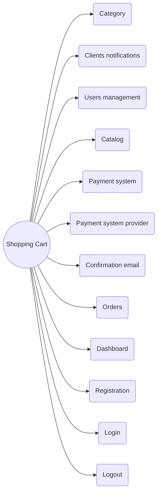

# E-commerce with Django

```mermaid
graph LR

A((Shopping Cart))
A --> B(Category)
A --> C(Clients notifications)
A --> D(Users management)
A --> E(Catalog)
A --> F(Payment system)
A --> G(Payment system provider)
A --> H(Confirmation email)
A --> I(Orders)
A --> J(Dashboard)
A --> K(Registration)
A --> L(Login)
A --> M(Logout)
```
